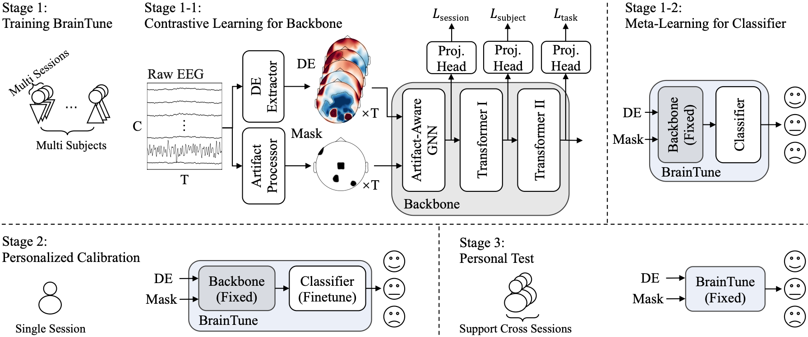

# BrainTune: An Artifact-Aware Meta-Contrastive Framework for Fast and Lasting Personalization of EEG Emotion Models

The official repository for our paper.

## 1. Brief Intro

BrainTune achieves rapid adaptation of the EEG-based emotion model to new subjects, without playing tricks of smoothing by the window size of the entire video length, and parameter searches on every subject.

**Key Ingredients**:

- Well-designed **Supervised Multi-Level Contrastive Learning** injects subject information to the model instead of struggling to find emotion invariant features.
- BrainTune innovatively introduces **Artifact-Aware GNN**, which alleviates the harmful impact brought by artifact. 
- **MAML** is used to realize fast adaptation.
- **Real-time applicability**, to be honest, is a by-product of data processing methods where every subjects' DE features are normalized by a uniform mean and std.



- **Stage 1**: Training with contrastive learning and meta-learning.
- **Stage 2**: Finetuning the classifier with a short period of data from a new subject.
- **Stage 3**: Testing on the subject’s this or other sessions.

For more information, please refer to our paper.

## 2. Environment

My environment is `pytorch 2.3.1` + `python 3.11.9`, but others should be also feasible. Besides, `mne` and `h5py` are used for data processing; `matplotlib` and `cuml` are used for visualization.

## 3. Data and Preprocessing

**Data**

BrainTune has been trained and tested on the SEED series, DEAP, and DREAMER datasets. However, to fully appreciate BrainTune's design, we recommend starting with the SEED series. You can download the data in the official website https://bcmi.sjtu.edu.cn/ApplicationForm/apply_form/. In this paper, only the original `cnt` files of SEED, SEED-IV and SEED-V are used and we recalculated the DE features, because the DE features offered in the official website are smoothed by LDS which do not meet the requirement of real-time.

Put these `cnt` files in `data` folder like:
```
data
├── seed3 # 1_1 ~ 15_3
│   ├── 1_1
│   │   └── 1_1.cnt
│   ├── 1_2
│   │   └── 1_2.cnt
│   ├── 1_3
│   │   └── 1_3.cnt
│   └── 2_1 ~ 15_3 # the remaining folders and files
├── seed4 # 1_1 ~ 15_3
│   └── ...
└── seed5 # 1_1 ~ 16_3
    └── ...
```

**Preprocessing**

```python
# In preprocess/seed3~5 folder
# extract DE features
python buildDE.py --name 1_1
# extract artifact
python buildh5.py --name 1_1
python buildh5_hp.py --name 1_1
python buildArtifact.py --name 1_1
```

We also provide `preprocess/sh_run.sh` script as an example for parallel processing. *(Be cautious about your computer memory)*

After preprocessing, it should look like:

```
1_1
├── 1_1(1-45+50).h5
├── 1_1(1-_+50).h5
├── 1_1.cnt
├── artifact
│   ├── all.npy
│   ├── amp_spa.npy
│   ├── amp_tem.npy
│   ├── flat_naninf.npy
│   ├── hfnoise.npy
│   └── vertical_eog.npy
└── de.h5
```

**Artifact Visualization**

A matplotlib tool is developed to visualize artifact. Please refer to `README.md` in `artifact` folder.

## 4. Run

BrainTune is trained with happy, neutral and sad data from SEED, SEED-IV and SEED-V from all subjects across three sessions except the test subject. And it is tested on the target subject's last session's final 12 videos. The calibration data starts with the first three 3 video clips from the first session, incrementally adding three 3 clips at a time, up to the first three clips from the final session. 

```python
# In BrainTune folder
# Stage 1-1 Contrastive learning for backbone
python pretrain_s1.py --save-dir pretrain_s1 --test-subject 1

# Stage 1-2 Meta-learning for classifier
python pretrain_s2.py --save-dir pretrain_s2 --test-subject 1

# Stage 2 and 3 Calibration and test
# Here xx in coldStart/xx can be 11,12,13,14,15,21,22,23,24,25,31
# which increases calibration data gradually
python coldStart.py --test-subject 1 --save-dir coldStart/11
```

We also provide `run.sh` as an example to iterate each test subject in SEED.

## 5. Visualization

Here we provide two important visualization in `vis` folder.

- `python DE_distance.py` validates the distance between same subject and same session < between same subject across different sessions < between different subjects;

- `python model_feature.py --feat {tsk,sub,exp}` visualizes the features of BrainTune's each layer.

## 6. Some Thoughts

- The domain shift in EEG is enormous, which may also exist in other physiological signals.

- There is actually no guarantee that the emotion is fully evoked in SEED dataset series.

- Maybe our design will work for other physiological signals.